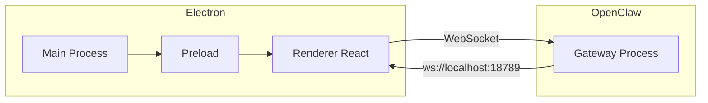

# 架构说明

## Electron 三进程

- **Main**：窗口与生命周期、系统 API（如打开文件夹）。不直接连 WebSocket。
- **Preload**：桥接 Main 与 Renderer，暴露有限 API（如 `openFolder(path)`、`getPlatform`）。
- **Renderer**：Vite 构建的 React 应用，负责所有 UI；在此建立与 OpenClaw Gateway 的 WebSocket 连接（或通过封装的 GatewayClient）。

## 数据流

```
用户操作 (Renderer)
    → GatewayClient.send(type, payload)
    → WebSocket → OpenClaw Gateway (localhost:18789)
    → Gateway 处理 (Brain/Hands/Memory/...)
    → WebSocket 推送 message
    → GatewayClient 解析 → Zustand store 更新
    → React 组件重渲染
```

- 连接状态、消息列表、设置等均通过 Zustand 管理；WebSocket 回调和用户操作只读写 store，不跨进程传大量数据。

## 与 Gateway 的集成架构

- Renderer 内维护一条到 `ws://localhost:18789`（或配置的 URL）的 WebSocket 长连接。
- 所有与 OpenClaw 的交互（chat、status、heartbeat_trigger、skill_invoke）都封装为 **GatewayClient** 方法，内部发 JSON 消息并处理回复与错误。
- 认证：若 Gateway 启用 auth，在连接 URL 上加 `?token=...`（token 来自设置页）。



详见 [04-gateway-integration.md](04-gateway-integration.md)。
