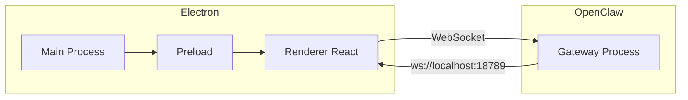

# OpenClaw 桌面版（Vite + React + Electron）技术实现计划

## 目标与范围

- **目标**：开发一个桌面端应用，作为 OpenClaw 的本地客户端，通过 Gateway WebSocket 控制面与已运行的 OpenClaw 后端通信。
- **前提**：本机已安装并运行 OpenClaw（`openclaw gateway` 或 daemon），Gateway 默认监听 `ws://localhost:18789`。
- **不包含**：不实现 Gateway/Brain/Hands 等后端逻辑，仅实现桌面 UI 与协议层。

## 技术栈

| 层级 | 选型 | 说明 |
|------|------|------|
| 桌面壳 | Electron | 主进程、preload、渲染进程分离 |
| 构建 | Vite | 渲染进程用 Vite 构建 React，支持 HMR |
| 前端 | React 18+ | UI 与状态管理 |
| 语言 | TypeScript | 全项目 TS |
| 状态管理 | **Zustand** | 全局与页面状态 |
| 通信 | WebSocket (native / ws) | 与 OpenClaw Gateway 通信 |

可选：UI 库（如 shadcn/ui）、CSS（Tailwind）。

## 架构概览



- **Electron**：Main 负责窗口/生命周期；Preload 暴露安全 API（如打开外部配置目录）；Renderer 为 Vite 构建的 React 应用。
- **与 Gateway 的通信**：在 Renderer 或通过 Preload 暴露的封装里建立 WebSocket 连接至 `ws://localhost:18789`，使用 [Gateway API](https://clawdocs.org/reference/gateway-api) 的 JSON 消息格式（见下）。

## OpenClaw Gateway 集成要点

- **连接**：`WebSocket('ws://localhost:18789')`，若启用 auth 则 URL 加 `?token=...`。
- **统一消息结构**：`{ type, id?, payload, timestamp }`。
- **客户端 → Gateway**：`chat`（对话）、`status`（状态）、`heartbeat_trigger`、`skill_invoke`。
- **Gateway → 客户端**：`response`、`tool_call`、`tool_result`、`error`、`heartbeat_status`。
- **实现要点**：在桌面端封装一个 GatewayClient（连接管理、重连、按 `id` 关联 request/response），所有界面功能基于该客户端调用上述消息类型。

## OpenClaw Memory 机制与系统提示词（桌面端需知）

桌面端不直接读写这些文件，但需在文档与 UI 中体现（如「打开工作区」、设置里展示路径），以便用户理解 OpenClaw 行为与可维护性。

### 工作区记忆文件结构（~/.openclaw/workspace/）

| 文件 | 用途 |
|------|------|
| **SOUL.md** | 行为核心：性格、价值观、不可妥协的约束；影响跨会话一致性 |
| **USER.md** | 用户偏好层：沟通风格、输出格式、常用偏好、已知约束 |
| **AGENTS.md** | 顶层操作契约：优先级、边界、工作流、质量要求（稳定规则，非临时任务） |
| **IDENTITY.md** | 结构化身份：名称、角色、目标、语气；可用 `openclaw agents set-identity --from-identity` 应用 |
| **MEMORY.md** | 长期记忆：持久事实与压缩历史，跨日保留；受 `agents.defaults.compaction.memoryFlush` 控制 |
| **memory/YYYY-MM-DD.md** | 按日工作日志，自动预注入、可被记忆检索 |
| **memory/projects.md** | 项目相关记忆（项目约定、进度摘要等，可选） |
| **memory/infra.md** | 基础设施/环境相关记忆（路径、环境变量、工具约定等，可选） |
| **memory/lessons.md** | 经验教训与复盘（可选） |

其他运维相关：TOOLS.md（工具与环境）、HEARTBEAT.md（心跳节奏与仪式）、BOOT.md（启动钩子）、BOOTSTRAP.md（首次访谈脚本）。

### 系统内置提示词（由 OpenClaw 组装，桌面端只读展示或文档说明）

- **结构**：每次运行由 OpenClaw 动态组装，非单段静态文本。固定部分包括：Reasoning、Runtime（主机/OS/Node/模型/仓库根/思考级别）、Heartbeats、Reply Tags、Current Date & Time、Sandbox、Workspace Files（注入）、Documentation、Skills、Safety、Tooling。
- **工作区引导注入**：以下文件被修剪后注入（每文件默认最大约 20k 字符，总上限约 150k）：BOOTSTRAP.md、HEARTBEAT.md、USER.md、IDENTITY.md、TOOLS.md、SOUL.md、AGENTS.md；MEMORY.md / memory.md 亦在项目上下文中。
- **promptMode**：`none`（仅身份行）、`minimal`（子智能体，省略 Skills/记忆召回等）、`full`（默认，完整）。
- **桌面端可做**：在「关于 / 帮助」或设置中说明上述机制；提供「打开工作区目录」按钮（Electron 打开 `~/.openclaw/workspace`），便于用户直接编辑 soul/user/agents/memory 等文件。

## 功能模块建议

1. **连接与状态**：检测 Gateway 是否可达、显示连接状态、可配置端口/认证。
2. **聊天**：输入框 + 消息列表，发送 `chat`、展示 `response`，可选展示 `tool_call` / `tool_result`。
3. **状态与心跳**：发送 `status` 显示运行状态；可选触发 `heartbeat_trigger` 并展示 `heartbeat_status`。
4. **技能**：发送 `skill_invoke`（技能名 + args），展示结果或错误。
5. **设置**：Gateway 地址、端口、认证 token；「打开 ~/.openclaw」与「打开工作区 ~/.openclaw/workspace」快捷方式（Electron 打开目录）。
6. **记忆/工作区说明**：帮助或设置中简述 SOUL/USER/AGENTS/MEMORY 及 memory/* 的作用，引导用户自行编辑。

## 项目脚手架与结构

- **脚手架**：使用 **@quick-start/electron**，创建时选择 **Vite** 与 **React**（推荐 TypeScript：`react-ts`）。
  - 命令：`npm create @quick-start/electron <项目名>`，在交互中选择 Vite、React（或 react-ts）。
  - 生成结构通常包含：`src/main`（主进程）、`src/preload`、`src/renderer`（Vite + React），以及 electron-builder、electron-updater 等配置。
- **状态管理**：在 `src/renderer` 内使用 **Zustand** 管理连接状态、会话消息、设置等（例如 `stores/gateway.ts`、`stores/chat.ts`、`stores/settings.ts`）。

```
Dobby/                     # 由 @quick-start/electron 生成后调整
├── description/           # 本计划及详细说明（见下）
├── src/
│   ├── main/              # Electron 主进程
│   ├── preload/           # Preload 脚本
│   └── renderer/          # Vite + React 渲染进程
│       ├── src/
│       │   ├── App.tsx
│       │   ├── api/       # Gateway WebSocket 封装
│       │   ├── components/
│       │   ├── pages/
│       │   └── stores/    # Zustand stores
│       └── ...
├── package.json           # 脚本: dev, build 等
└── electron-builder 等配置
```

## 开发、构建与发布

- **开发**：先启动 Vite dev server，再启动 Electron 加载 `http://localhost:5173`（或使用 wait-on + concurrently 一键 `npm run dev`）。
- **构建**：Vite 构建 React → `dist`；Electron 主进程构建 → `dist-electron`；packager（electron-builder）打包成各平台安装包。
- **发布**：可选 electron-updater 做自动更新。

## 交付物：description 文件夹内容

实施阶段将在项目根目录下创建 **description** 文件夹，并写入以下详细计划文档（便于后续按文档执行与迭代）：

| 文件 | 内容 |
|------|------|
| [description/00-README.md](description/00-README.md) | description 目录说明与文档索引 |
| [description/01-overview-and-goals.md](description/01-overview-and-goals.md) | 项目背景、目标、与 OpenClaw 的关系、非目标 |
| [description/02-tech-stack-and-tooling.md](description/02-tech-stack-and-tooling.md) | Vite/React/Electron/TypeScript、**Zustand**、推荐依赖与版本 |
| [description/03-architecture.md](description/03-architecture.md) | Electron 三进程、数据流、与 Gateway 的集成架构图与说明 |
| [description/04-gateway-integration.md](description/04-gateway-integration.md) | WebSocket 连接、Gateway API 消息格式、Client 封装设计、错误与重连 |
| [description/04b-memory-and-system-prompt.md](description/04b-memory-and-system-prompt.md) | **Memory 机制**：soul.md、user.md、agents.md、MEMORY.md、memory/YYYY-MM-DD.md、memory/projects.md、memory/infra.md、memory/lessons.md；**系统内置提示词**：结构、工作区注入、promptMode；桌面端如何展示与打开工作区 |
| [description/05-features-and-ui.md](description/05-features-and-ui.md) | 功能列表（连接、聊天、状态、心跳、技能、设置、工作区入口）与界面/路由规划 |
| [description/06-project-structure-and-scaffolding.md](description/06-project-structure-and-scaffolding.md) | **@quick-start/electron**（Vite + React/React-TS）脚手架、目录结构、Zustand stores 规划、npm 脚本与环境变量 |
| [description/07-dev-build-release.md](description/07-dev-build-release.md) | 开发流程、调试、构建、打包与发布步骤 |
| [description/08-implementation-phases.md](description/08-implementation-phases.md) | 建议实施阶段（脚手架 → 连接层 → 聊天 → 状态/技能 → 设置与打包） |

以上文档均为 Markdown，包含本计划中的要点并展开为可执行的说明与代码级参考（如消息示例、接口命名建议）。共 10 份文档（含 04b Memory 与系统提示词）。

## 实施顺序建议

1. **脚手架**：使用 `npm create @quick-start/electron`，选择 Vite 与 React（或 react-ts），确认 dev/build 正常；引入 Zustand。
2. **连接层**：实现 Gateway WebSocket 封装（连接、重连、`chat`/`status`/`response`/`error`）。
3. **最小可用**：连接状态 + 单页聊天（发送一条、显示一条）。
4. **完善聊天**：消息列表、tool_call/tool_result 展示、多轮对话。
5. **状态与技能**：status 页、heartbeat_trigger、skill_invoke 入口与结果展示。
6. **设置与打包**：Gateway 配置、安装包与可选自动更新。

---

**总结**：桌面端作为 OpenClaw 的“本地控制台”，使用 **@quick-start/electron（Vite + React）** 脚手架、**Zustand** 做状态管理，通过标准 Gateway WebSocket API 与已有 OpenClaw 实例通信；技术实现计划将完整写入 `description/` 下 10 个文档（含 Memory 机制与系统提示词说明），便于团队按阶段实施与维护。
